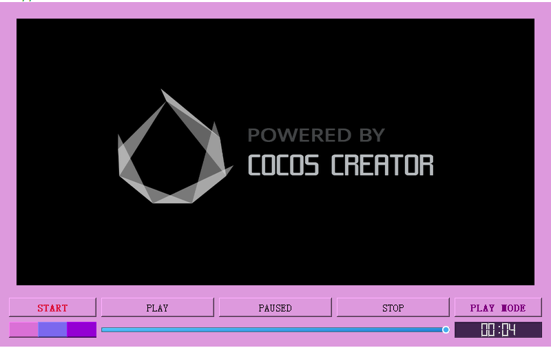
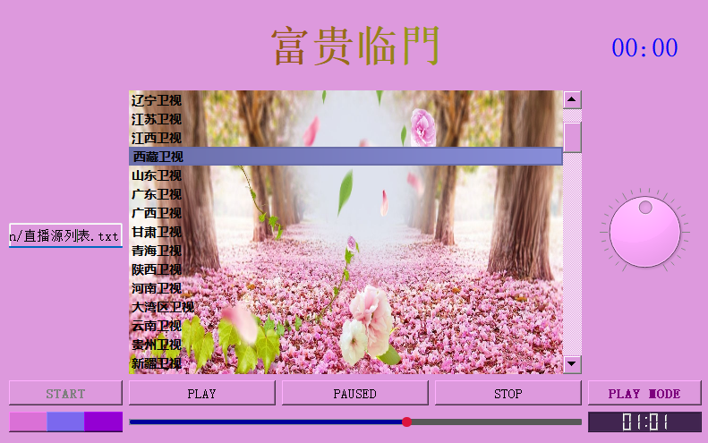
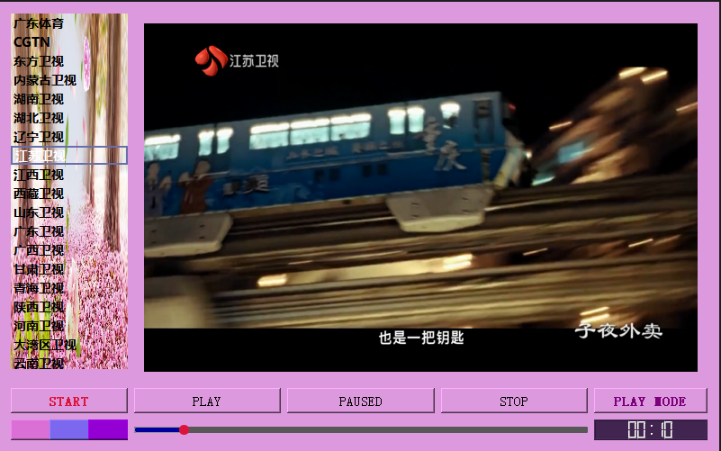
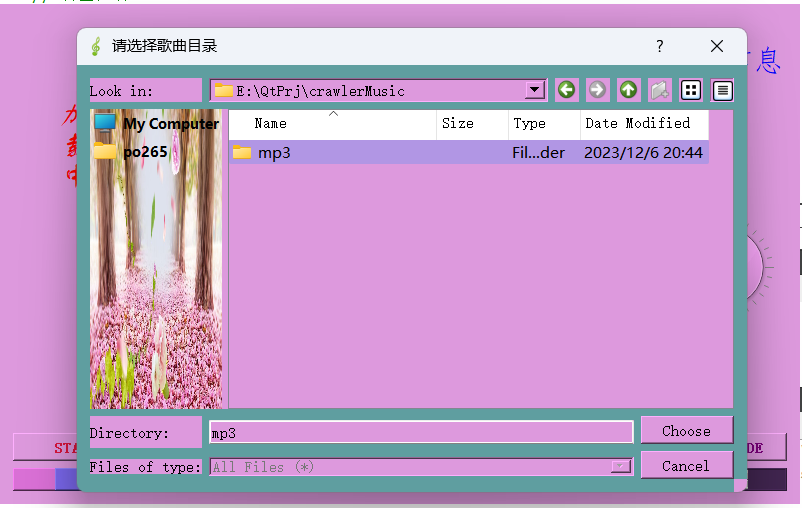
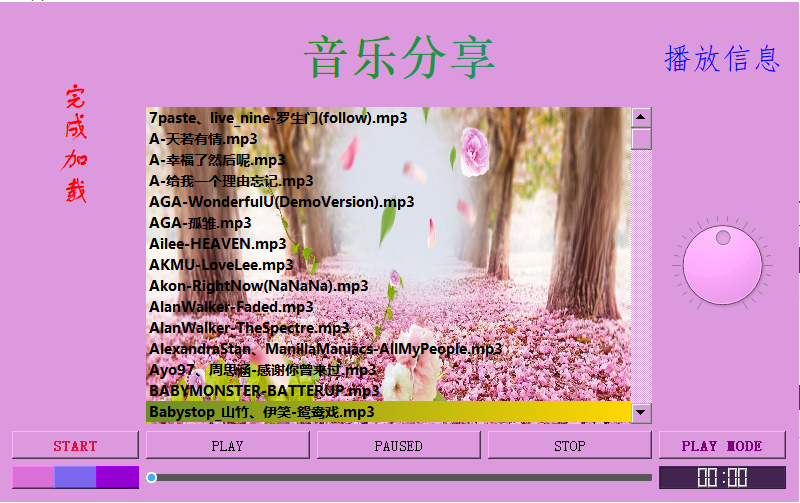
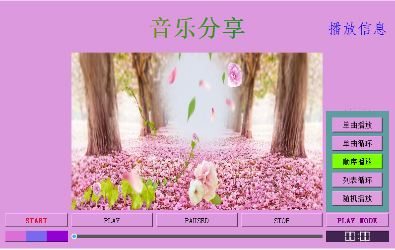

Qt制作的一款音乐播放器
Qt 版本：5.15.2
IDE：Qt Creator 4.15.2
编译器：MinGW 8.1.0 x86_64


仅用于学习交流，禁止用于商业用途，如用于商业用途请自行承担风险。如若侵犯了您的权益，请联系我删除。po2656233@qq.com 或 13500011584

---功能展示---
<h4>2、支持音视频文件导入、在线加载</h4>
<h4>1、支持歌曲的快进、暂停、播放、停止，注：直播不允许该操作</h4>
<h4>2、支持歌词展示(需歌词文件)，注: 歌词文件和歌曲文件放置同一目且文件名相同</h4>
<h4>4、支持本地音乐、在线音乐、网络音乐、直播音乐、电影等播放</h4>
<h4>5、右键功能列表,请自行探寻</h4>


```
直播源格式：别名|真实直播源地址(m3u或m3u8等格式)
使用方法:
    【START】-->【网络资源】将文件绝对路径写入编辑栏，如:file:///E:/gitPrj/MusicCelebration/直播源列表.txt 按回车键后，等待加载结束，双击子项即可播放
```

---使用说明---
    1、双击播放
     2、双击暂停
     3、双击停止
     4、双击快进
     5、双击快退
     6、双击播放上一首
     7、双击播放下一首
     8、双击播放上一集
     9、双击播放下一集

---效果展示---
<h3>视频</h3>

 

<h3>电视直播</h3>




<h3>歌曲</h3>


<h3>操作</h3>








---声明---      
禁止用于商业用途，禁止用于违反国家法律法规的行为，禁止用于任何非法目的
